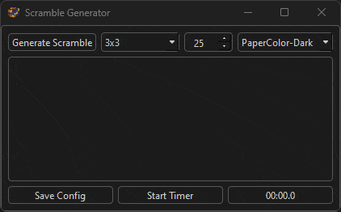
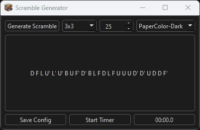

  

## Donations

## Purpose

The general purpose of this app is to give people an easy way to generate scrambles for standard twisty puzzles.

## App Showcase

## Useful Information

- [Project Goals](https://github.com/users/melvinquick/projects/2/views/1)
- [Latest Version Direct Download Link (ZIP)](https://github.com/melvinquick/scramble-generator/releases/latest/download/scramble-generator.zip)
- [Latest Version Direct Download Link (SETUP)](https://github.com/melvinquick/scramble-generator/releases/latest/download/setup.exe)
