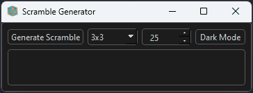

  

# Scramble Generator

### Attributions

- Logo: <a href="https://www.flaticon.com/free-icons/rubik" title="Rubik icons">Rubik icons created by DinosoftLabs - Flaticon</a>

## Purpose

The general purpose of this app is to give people an easy way to generate scrambles for 2x2 and 3x3 Rubik's Puzzles.

## Project Goals

| Status             | Goal                                                         |
| ------------------ | ------------------------------------------------------------ |
| :white_check_mark: | Create Logo                                                  |
| :white_check_mark: | Create GUI with PyQt6                                        |
| :white_check_mark: | Generate scrambles for standard twisty puzzles               |
| :x:                | Distribute as an EXE using PyInstaller and/or Auto-Py-To-Exe |
| :white_check_mark: | Theme GUI to PaperColor                                      |
| :white_check_mark: | Add toggle for dark/light mode                               |

## Dark/Light Theme Showcase

